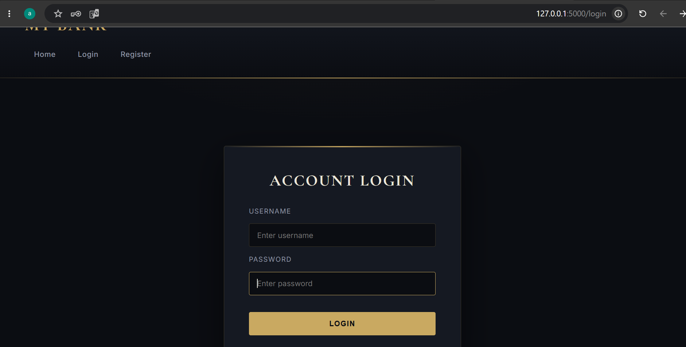
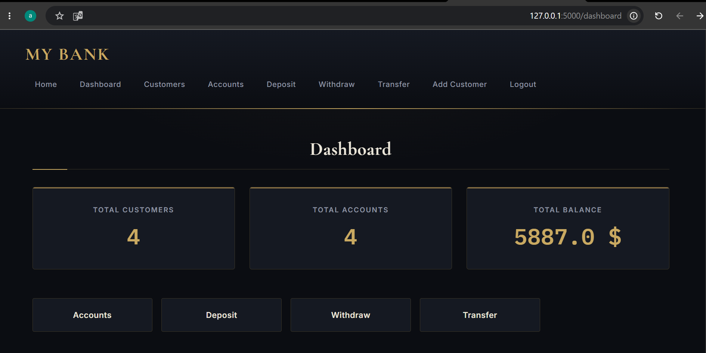

# 🏦 Bank Management System

A modern **Bank Management System** built with **Python, Flask, and SQLite**.
The project simulates basic banking operations with user authentication, customer management, and account transactions.

## 📸 Screenshots

### Login Page


### Dashboard



## 🚀 Features

* 🔐 User Authentication (Login / Register)
* 👥 Customer Management
* 🏦 Create Bank Accounts
* 💰 Deposit and Withdraw Money
* 📊 Dashboard with Statistics
* 🔑 Role-based Users (Admin / Customer)
* 🗄️ SQLite Database Integration
* 🔒 Password Hashing for Security

## 🛠️ Technologies Used

* Python 3
* Flask
* SQLite
* HTML5
* CSS3
* Jinja2 Templates
* Werkzeug Security

## 📂 Project Structure

```
bank/
│
├── app.py
├── database.py
├── bank_manager.py
├── models/
│   ├── user.py
│   ├── customer.py
│   └── account.py
│
├── templates/
│   ├── login.html
│   ├── register.html
│   ├── dashboard.html
│   └── customers.html
│
├── static/
│   └── css/
│
└── README.md
```

## ⚙️ Installation

Clone the repository:

```bash
git clone https://github.com/amroalalssi-cell/bank-management-system.git
```

Go to the project folder:

```bash
cd bank-management-system
```

Create virtual environment:

```bash
python -m venv .venv
```

Activate environment:

Windows:

```bash
.venv\Scripts\activate
```

Install requirements:

```bash
pip install -r requirements.txt
```

Run the application:

```bash
python app.py
```

The application will run on:

```
http://127.0.0.1:5000
```

## 📸 Screenshots

(Add project screenshots here)

## 👨‍💻 Author

**Amro Alalssi**

Junior Python / Flask Developer

GitHub:
https://github.com/amroalalssi-cell
